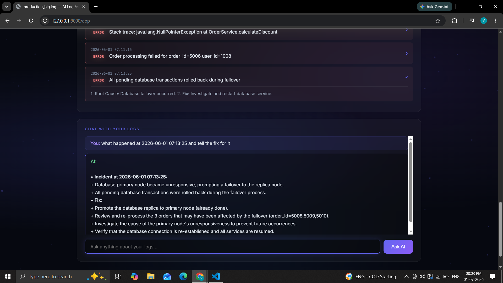

# AI Log Intelligence Assistant

A simple AI-powered app for analyzing application logs. Upload a .log or .txt file, view log summaries and errors, ask questions about the logs, and download a PDF report with AI-generated insights.

## Features

- Upload and parse log files
- Show log-level summary and error highlights
- AI-based root cause analysis and fix suggestions
- Chat with the uploaded logs
- Download PDF reports

## Tech Stack

- Python + FastAPI
- Groq API (Llama 3.3)
- HTML/CSS/JavaScript
- Chart.js + ReportLab

## Setup

```bash
git clone <repo-url>
cd Project
python -m venv .venv
.\.venv\Scripts\Activate.ps1
pip install -r requirements.txt
```

Create a .env file:

```env
GROQ_API_KEY=your_groq_api_key_here
```

Run:

```bash
uvicorn backend.app:app --reload
```

Open:

```text
http://127.0.0.1:8000/app
```

## Screenshots




> Place screenshot files in a `screenshots/` folder next to `README.md` with the names above.
